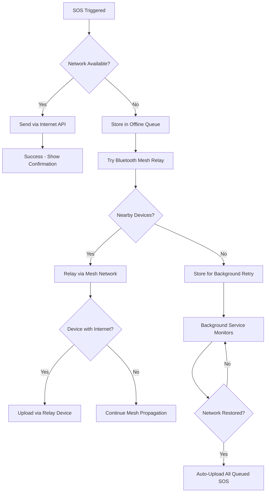

# SAHAYAK Offline Emergency System Documentation

## Overview

The SAHAYAK Offline Emergency System provides comprehensive emergency functionality when internet or mobile network is unavailable. It uses only internal Android hardware and implements multiple fallback mechanisms to ensure emergency messages reach authorities even in complete network blackout scenarios.

## System Architecture

```
┌─────────────────┐    ┌─────────────────┐    ┌─────────────────┐
│   Primary SOS   │    │  Offline SOS    │    │  Mesh Network   │
│   (Internet)    │───▶│  Auto-Retry     │───▶│  Bluetooth      │
│                 │    │  Engine         │    │  P2P Relay      │
└─────────────────┘    └─────────────────┘    └─────────────────┘
         │                       │                       │
         │                       │                       │
         ▼                       ▼                       ▼
┌─────────────────┐    ┌─────────────────┐    ┌─────────────────┐
│  Government     │    │  Stealth        │    │  Offline        │
│  Emergency      │    │  Triggers       │    │  Beacon         │
│  Services       │    │  (Hidden)       │    │  (Light/Audio)  │
└─────────────────┘    └─────────────────┘    └─────────────────┘
```

## Core Components

### 1. OfflineSOSService
**Purpose**: Manages SOS message queuing, encryption, and automatic retry logic
**Key Features**:
- Encrypted local storage using `react-native-encrypted-storage`
- Background retry service using `expo-task-manager`
- Dead-man switch timer functionality
- Automatic network state monitoring

### 2. MeshNetworkService  
**Purpose**: Implements Bluetooth mesh networking for peer-to-peer SOS relay
**Key Features**:
- Device discovery via Bluetooth Classic + WiFi Direct
- Encrypted SOS package routing through multiple hops
- Automatic upload when any device regains connectivity
- Mesh topology with relay path tracking

### 3. StealthTriggerService
**Purpose**: Hidden emergency triggers that work without visible UI changes
**Key Features**:
- Accelerometer-based shake detection (3 shakes)
- Power button press detection (5 quick presses)
- Stealth PIN validation system
- Silent haptic feedback

### 4. OfflineBeaconService
**Purpose**: Emergency signaling using device hardware when all else fails
**Key Features**:
- Flashlight morse code transmission
- High-frequency audio beacon generation
- Emergency QR code with rescue information
- Continuous operation in background

## Integration Strategy

The offline system integrates with existing internet functionality as a **fallback layer**:

1. **Primary Path**: Normal internet-based SOS sending
2. **Fallback Path**: Offline system activates when network unavailable
3. **Recovery**: Automatic retry and upload when connectivity returns



## Data Flow

### SOS Message Structure
```typescript
interface SOSPayload {
  id: string;                    // Unique identifier
  userId: string;               // User identification
  location: LocationData;        // GPS coordinates with accuracy
  userProfile: UserProfile;     // Medical info, emergency contacts
  deviceInfo: DeviceInfo;       // Platform, battery, model
  emergencyType: EmergencyType; // sos, medical, police, fire, deadman
  triggerMethod: TriggerMethod; // manual, shake, power_button, stealth_pin
  timestamp: number;            // Creation time
  priority: Priority;           // CRITICAL, HIGH, MEDIUM
  encrypted: boolean;           // Encryption status
  retryCount: number;           // Attempt counter
  relayPath?: string[];         // Mesh routing history
  hops?: number;               // Mesh hop count
}
```

### Encryption Strategy
- **AES-256 encryption** for all stored SOS data
- **Hardware-backed keystore** when available
- **Device-specific salt** for key derivation
- **Tamper detection** with integrity checks

## Background Operations

### Service Architecture
```
ForegroundService (Always Running)
├── NetworkMonitor (Connectivity checks)
├── RetryEngine (Queue processing)
├── MeshNetwork (Bluetooth discovery)
├── DeadManSwitch (Timer monitoring)
└── StealthTriggers (Sensor monitoring)
```

### Battery Optimization Handling
- Request **ignore battery optimization** permission
- Use **ForegroundService** with notification
- Implement **WakeLock** for critical operations
- **AlarmManager** for periodic wake-ups

## Security Considerations

### Stealth Operation
- **No visible notifications** during stealth mode
- **Haptic-only feedback** for stealth triggers
- **Encrypted storage** prevents data inspection
- **Process name obfuscation** in system settings

### Data Protection
- **Local encryption** before storage
- **Secure key management** using Android Keystore
- **Data integrity** verification
- **Automatic key rotation** on security events

## Performance Optimization

### Bluetooth Mesh Efficiency
- **Connection pooling** for discovered devices
- **Intelligent routing** based on signal strength
- **Hop limit** to prevent infinite loops
- **Battery-aware** relay selection

### Background Resource Management
- **Adaptive retry intervals** (exponential backoff)
- **CPU throttling** during low battery
- **Memory optimization** for queue management
- **Network usage minimization**

## Testing & Validation

### Test Scenarios
1. **Complete network blackout** - verify local storage
2. **Partial connectivity** - test mesh relay
3. **App termination** - background service survival
4. **Device reboot** - service auto-restart
5. **Battery optimization** - functionality under restrictions

### Debug Interface
- Real-time mesh network status
- SOS queue inspection
- Service health monitoring
- Performance metrics dashboard

## Compliance & Legal

### Emergency Services Integration
- **E911 compliance** where applicable
- **Location accuracy** requirements met
- **Emergency contact** notification system
- **Service reliability** standards

### Privacy Protection
- **Minimal data collection** principle
- **Local-first** data storage
- **User consent** for all features
- **Data retention** policies

## Future Enhancements

### Planned Features
- **Satellite communication** via Android 14+ APIs
- **LoRaWAN integration** for long-range communication
- **ML-based** emergency detection
- **Community mesh** network expansion

### Hardware Integration
- **Emergency beacons** via Bluetooth LE
- **Wearable device** connectivity
- **Vehicle integration** via Android Auto
- **Smart home** emergency triggers